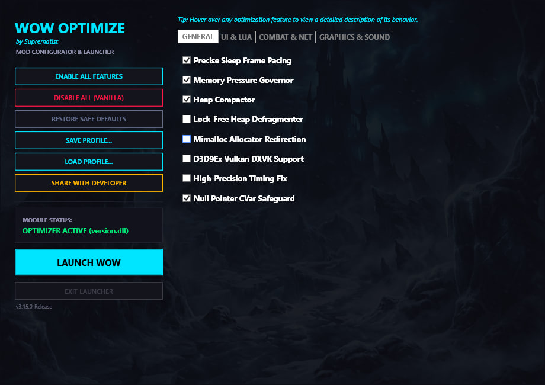

# wow_optimize

Performance optimization DLL for World of Warcraft 3.3.5a (WotLK)
Author: SUPREMATIST

wow_optimize improves WoW 3.3.5a at the engine and runtime level: memory allocation, Lua VM behavior, Lua library fast paths, timers, file I/O, networking, heap fragmentation, lock contention, the 16-year combat log bug fix, and other low-level bottlenecks.

The current public build is focused on real frametime stability, long-session smoothness, addon-heavy gameplay, and lower Lua/runtime overhead while keeping historically unsafe features disabled.

> Disclaimer: This project is provided as-is for educational purposes. DLL injection may violate the Terms of Service of private servers. Use at your own risk.

---

## Table of Contents
* [What's New in the Upcoming Update (v3.15.0)](#whats-new-in-the-upcoming-update-v3150)
* [Reviews & Acknowledgments](#reviews)
* [Current Feature Set](#current-feature-set)
* [Installation](#installation)
* [Compatibility & Setup](#compatibility--setup)
* [Multi-client Support](#multi-client-support)
* [macOS / Apple Silicon (WoWSilicon)](#macos--apple-silicon-wowsilicon)
* [Building](#building)
* [Core Architecture](#core-architecture)
* [Troubleshooting & Diagnostics](#troubleshooting)

---

## What's New in the Upcoming Update (v3.15.0)

This release marks a significant milestone, bringing together substantial performance restorations, stability updates, runtime enhancements, and a unified desktop dashboard manager. Over 42 optimization features have been verified, stabilized, and dynamically gated at runtime, resulting in a smoother and stutter-free experience.

### Modular Configurator Launcher (v3.15.0)
- **`wow_optimize_launcher.exe` Configurator** — Allows players to dynamically toggle all 42 optimization features via a C# WPF UI (no DLL recompiles required).
- **Save & Load Profiles** — Supports exporting/importing customized configurations as `.ini` profiles.
- **Preset Sharing** — Features a "Share with Developer" button to copy active settings to the clipboard for submitting safe profile recommendations.
- **Update Checker** — Checks for new versions on startup and displays a link when an update is available on GitHub.



### Core Performance & Allocator Updates (v3.15.0)
- **Asynchronous Terrain Mesh Loader & Collision Decoupler** — Offloads ADT map grid loading and physical geometry parsing to background worker threads during gameplay. Hooks ground elevation query `sub_7C1660` to return player's current Z coordinate as height fallback during active loads, preventing falling through the world.
- **Asynchronous Texture Hot-Swapping & Storm VFS** — Intercepts `0x004B8910` (`TexCreateBLP`) via assembly detour. Instantly returns placeholder white texture and background loads real BLP into an in-memory Virtual File System (VFS). On frame boundary (`OnFrame`), the real texture wrapper is built from the VFS and hot-swapped into place without stutters.
- **RCU Client Object Manager Traverser** — Hooks `sub_6DED60` (`TSExplicitList::LinkNode`), `sub_4D4C20` (`UnlinkNode`), and `sub_4D4B30` (`ClntObjMgrEnum`) to replace linear linked-list entity traversals with an atomic pointer flat mirror array, removing list search and lock contention on the main thread in raids.
- **Deferred Heap Compactor** — Defers memory compaction during loading screens to run once upon screen closure, preventing character login freezes.
- **Lua VM Bytecode JIT Redirection & Cache** — Redirects Lua VM detours to target the standard call preparation function `sub_856370` instead of telemetry-only routines, enabling JIT stubs under normal play conditions. Upgraded with a thread-safe, lock-free, direct-mapped cache (`g_protoCache`) replacing the slow `std::unordered_map` lookups on the hot path to eliminate mutex contention during profiling.
- **mimalloc Allocator Redirect** — Replaced WoW's statically-linked CRT memory allocator (`malloc`, `free`, `realloc`, `calloc`, `_msize`, and `_recalloc`) with Microsoft's high-performance `mimalloc` engine. This utilizes a custom transition guard and atomic activation to combat 32-bit virtual-address (VA) fragmentation during long play sessions, character swapping, or teleporting.
- **Adaptive Purge & VA-Pressure Governor** — The memory manager dynamically tunes allocator purge delay based on OS virtual memory pressure (aggressive cleanup when largest free block is low, gentle otherwise to avoid recommit page-fault storms).
- **Wow-Internal strlen/memcpy/memset SSE2 Replacements** — Inlined hand-written assembly replacements for critical CRT string and memory operations to avoid scalar bottlenecking in asset loading. Includes non-temporal streaming stores for copies $\ge$ 256 KB.
- **Free-Wrapper Fast Path** — Directs deallocations to bypass redundant heap-walk overheads on one of the hottest paths in the binary.
- **Hook Enable Batching** — Startup times have been improved by over 1.7 seconds by batching MinHook hooks during startup initialization via single-snapshot batch activation.

### Lua VM & C-API Inlines (v3.15.0)
- **Safe Inline Caches & Stack Operations** — Restored and verified the optimized inline paths for `luaH_getstr` (16384 entries with prefetch), `lua_rawgeti` (8192-entry array direct & hash cache), `lua_toboolean`, and `lua_objlen` matching engine byte layouts exactly.
- **Lua VM Inline Fast-Path Groups** — Over 30 inline helpers (Safe Groups 1, 2, and 3) have been stabilized and activated (e.g. `string.gsub` plain-literal matching, `math.fmod`, `math.modf`, `string.char`, `select`, `rawequal`, `strjoin`, `strsplit`, etc.).
- **Adaptive GC Pacing** — Lua garbage collection intervals scale dynamically depending on frametime limits and VA-pressure triggers.

### SIMD Geometry, Math & Physics (v3.15.0)
- **Double-Precision Quaternion Normalization (`CQuaternion::Normalize`)** — Fully stabilized and re-enabled the custom SSE2 quaternion normalization hook (`0x00979110`). By moving from 32-bit float to 64-bit double precision, it matches original FPU outputs exactly, preventing floating-point precision drift and completely resolving the camera jiggling bug when steering.
- **Thread-Safe SIMD Statistics Counters** — Hardened all physics, culling, and rotation statistics counters using atomic 32-bit `InterlockedIncrement` operations to prevent data races between render and async engine worker threads.
- **Vectorized Frustum Culling & Geometry Math** — Bypassed legacy x87 FPU stack calculations with SSE2 vectorized operators for matrix multiplies (`CMatrix::operator*` at `0x004C1F00`), matrix-vector transformations (3D/4D transforms at `0x004C21B0` and `0x004C2270`), rigid inversions, and `CFrustum` culling.
- **SSE2 Network GUID Unpacking** — Vectorized network GUID unpacking (`CDataStore::GetWowGUID` at `0x0076DC20`) inside network packet handlers.

### Lua VM — Safe Inline Caches (active)
- `luaH_getstr`: bucket-index cache (16384 entries) with content validation — safe across GC rehash
- `lua_rawgeti`: array-direct O(1) path + bucket-index hash-part cache (8192 entries)
- `luaV_gettable` safety patch: validates TValue type field before using as array index

### 6 CPU-Side Optimization Modules
- **Off-screen animation throttle**: 3-tier distance-based update rate (full / 1:4 / 1:16)
- **SSE2 math**: matrix multiply, 4×4 matrix multiply, quaternion normalize, frustum AABB-vs-4-planes cull, frustum point culling, ray-triangle intersection, matrix-vector transforms, particle simulation throttling, network GUID unpacking, BGRA↔ARGB batch swap, premultiplied alpha
- **Combat text batching**: 256-entry ring buffer, flush-per-frame
- **UI layout dirty-flag cache**: 4096-slot frame-pointer keyed, generation-based invalidation
- **Network heartbeat filter**: suppresses CMSG_PING/CMSG_TIME_SYNC_RESP when data recently sent
- **Invariant Lua script cache**: 256-slot cache for UnitHealth/UnitPower/UnitClass outcomes

### Memory & Async
- 64-byte aligned 8-tier slab allocator (64B–8192B) for cache-line-aligned hot structures
- 16384-entry GUID→object FNV-1a hash-table with lock-free reads
- 2-thread SPMC worker pool (2048 slots) for fire-and-forget task dispatch

### Infrastructure & Diagnostics
- 50-API infra_patch: object pools, deduplication, frame-time smoothing, adaptive cache TTL
- 20-feature hot_patch: datastore lookup cache, delete prefetch, tooltip early-exit, event dedup
- 3-hook hook_prefetch: SSE2 prefetch on cleanup/delete/datastore-reset paths
- CrashDumper: 128-slot feature registry + 256-entry hook call trace + minidump/text crash reports
- Freeze watchdog: 10s threshold with per-feature activity reporting
- Priority watchdog with rate-limited logging

### Caches
- Tooltip LRU (512 slots, 30s TTL), regex compiled-pattern (256 slots, 120s TTL)
- SSE2 trig lookup tables (4096-entry sin/cos, 1024-entry atan)
- Render state dedup (256 slots), event name lookup/hash caches
- event name lookup/hash caches

## Current Status

### Performance Metrics (Real-World Testing)
- **Frame time**: Smoother frametimes in addon-heavy raids
- **CPU usage**: Noticeable reduction in addon-heavy gameplay
- **Lua operations**: Faster table lookups (getstr/rawgeti caches) and library fast paths
- **Timing cache**: High QPC cache hit rate
- **String formatting**: High fast path hit rate

---

## Reviews

<details>
<summary><b>Click to expand community reviews and stability testers list</b></summary>

See what other players say: [Reviews and Testimonials](https://github.com/suprepupre/wow-optimize/discussions/10)

### Stability Testing Team


This project wouldn't exist without the community. Every crash report, every bisection test, every "hey this broke my addon" message directly shaped the release. 

Special thanks to:
Morbent, Darkmoore, Ethodeus, Billy Hoyle, tuan, NoGoodLife, feh_dois, David (`_oldq`), UNOB, DarkRockDemon, Raymond, Vandal, Mantork, Falcon, Muus

</details>

---

## Current Feature Set

<details>
<summary><b>Click to expand full optimized feature list (Memory, Lua VM, Math, Network, Async, I/O)</b></summary>

### Memory and allocator
- **mimalloc redirect of WoW's static CRT allocator** *(enabled)* — `malloc`/`free`/`realloc`/`calloc`/`_msize`/`_recalloc` routed to mimalloc as a closed set with a transition guard, to defragment 32-bit VA over long sessions (see *New optimizations*). `GlobalAlloc(GMEM_FIXED)` is also serviced from mimalloc.
- **Adaptive purge delay + memory-pressure governor** — purge aggression scales with VA pressure; forced `mi_collect` under critical pressure
- Lua allocator replacement *(disabled — corrupted pointers during login; the CRT redirect above is the safe path)*
- WoW `free`-wrapper fast path (calls WoW's own `free`, skips a redundant `_msize` heap-walk)
- Lua string table pre-sizing to reduce hash resize spikes
- Low Fragmentation Heap (LFH) enabled for process heap and new heaps
- **Deferred Heap Compactor** — defers process heap compaction during loading screens to run once upon screen closure, preventing character login freezes.

### Lua runtime
- adaptive manual Lua GC
- 4-tier GC stepping:
  - normal
  - combat
  - idle
  - loading
- GC step sync with !LuaBoost
- safe Lua stats export to addon
- Lua reload detection and clean reinitialization
- **Lua VM Bytecode JIT Redirection & Cache** — detours standard Lua VM preparation function `sub_856370` to run JIT stubs under normal play conditions, utilizing a lock-free direct-mapped cache (`g_protoCache`) to avoid profiling lock contention.

### WoW API result cache
- `GetItemInfo` - 8192-slot cache, Direct Memory Access *(disabled - breaks Aux / WCollections / ElvUI)*
- `GetSpellInfo` - disabled (icon corruption, crashes on relog)

### Lua internal caches
- `luaH_getstr` - generation-guarded table string-key lookup cache (8192-slot, SEH-protected)
- `luaH_getstr` inline v2 - safe bucket-index cache with SSE2 prefetch (16384 entries)
- `lua_rawgeti` inline v2 - safe array direct + bucket-index cache (8192 entries)

### Lua fast paths
- Phase 1:
  - `string.format`
- Phase 2 (safe, Lua API based) - **ENABLED**:
  - `string.find` (plain mode)
  - `string.match` (safe partial fast path)
  - `string.rep`
  - `string.gsub` (plain-literal fast path)
  - `type`
  - `math.floor`
  - `math.ceil`
  - `math.abs`
  - `math.max` (2 args)
  - `math.min` (2 args)
  - `math.random`
  - `math.sqrt`
  - `math.fmod`
  - `math.modf`
  - `string.len`
  - `string.byte`
  - `string.char`
  - `tostring`
  - `tonumber`
  - `select`
  - `rawequal`
  - `string.sub`
  - `string.lower`
  - `string.upper`
  - `table.concat` (disabled - direct RawTValue* stack writes caused hangs)
  - `unpack` (disabled - direct RawTValue* stack writes caused hangs)
  - `ipairs` (disabled - closure factory incompatible with WoW iterator pattern)
- C-global fast paths - **ENABLED**:
  - `strjoin`
  - `strtrim`
  - `strsplit`

### Lua VM internals
- `luaV_concat` and `luaS_newlstr` hooks disabled for public stability
- baseline-safe VM operation with zero overhead
- string table pre-sizing remains active to prevent rehash freezes

### Timers and frame pacing
- PreciseSleep on the main thread
- automatic single-client / multi-client timing behavior
- `GetTickCount` redirected to QPC-based timing
- `timeGetTime` redirected to the same QPC timeline
- QueryPerformanceCounter coalescing cache
- adaptive timer resolution
- hardcoded FPS cap raised from 200 to 999

### File I/O
- MPQ handle tracking
- retroactive MPQ handle scanner
- sequential-scan hints for MPQ access
- adaptive MPQ read-ahead cache
- skip `FlushFileBuffers` for tracked MPQ handles
- `GetFileAttributesA` cache
- `SetFilePointer` redirected to `SetFilePointerEx`

### Threading and synchronization
- SRWLOCK-based file cache locking
- main thread priority ABOVE_NORMAL
- ideal processor assignment
- process priority ABOVE_NORMAL
- CriticalSection spin count and spin-first entry path
- TLS-cached `GetCurrentThreadId` and pseudo-handle fast path

### Networking
- `TCP_NODELAY`
- immediate ACK frequency
- socket buffer tuning
- low-delay TOS
- keepalive (30s idle / 5s interval — tuned to keep NAT warm without dropping the connection on transient network jitter)

### Async loading and prefetching

Features that use worker threads and lock-free queues. Status reflects the current public-safe configuration; individual toggles live in `src/version.h`.

- **Async spell data prefetching** - predictive spell data loading before cast completes, reduces spell cast lag, worker thread with lock-free queue (4096 entries) and cache (4096 entries) *(disabled — placeholder worker with no producers)*
- **Multithreaded addon dispatcher** - parallelizes addon OnUpdate callbacks across worker thread pool (4 threads), reduces main thread CPU in addon-heavy setups, batch processing with lock-free queue (8192 entries) *(disabled - unsynchronized writes to WoW game state)*
- **Predictive MPQ prefetching** - tracks zone transitions and predicts next zone, prefetches textures/models/WMOs into OS cache before teleport, reduces zone loading stutters, worker thread pool (2 threads) with lock-free queue (2048 entries) *(enabled)*
- **Multithreaded combat log parser** - offloads combat log parsing to worker thread, reduces main thread CPU in raids, lock-free queue with async processing *(disabled — placeholder worker with no producers)*
- **Sound prefetching** - predicts and prefetches sound files based on spell casts, zone transitions, combat state, worker thread pool (2 threads) with lock-free queue (1024 entries) *(disabled — placeholder worker with no producers)*
- **Async quest/achievement loading** - async quest log and achievement data loading, worker thread with lock-free queue (512 entries) *(disabled — placeholder worker with no producers)*
- **Multithreaded nameplate renderer** - offloads nameplate rendering to worker threads, reduces main thread CPU in 25-man raids, priority system (Target > Focus > Nearby > Distant) *(disabled - unsynchronized writes to WoW game state)*
- **Model/M2 caching** - synchronous LRU cache (1024 entries) for loaded models, eliminates redundant model loading *(enabled)*
- **Asynchronous Texture Hot-Swapping & Storm VFS** *(enabled)* — detours TexCreateBLP to immediately return a placeholder white texture, background loads the real BLP data, and hot-swaps the underlying Direct3D 9 texture pointer and properties during frame boundaries (OnFrame) without visual stutters.
- **Asynchronous Terrain Mesh Loader & Collision Decoupler** *(enabled)* — offloads ADT terrain file loading and geometry compiling to background threads, decoupling collision checks via player Z height fallback, and detouring CMapGrid::Update to prevent character-select crashes.
- **RCU Client Object Manager Traverser** *(enabled)* — replaces linear linked-list entity traversals with lock-free atomic pointer flat mirror arrays updated on link/unlink events.
- **Addon dispatcher** - lightweight event-driven addon update dispatch *(enabled)*

### Other runtime optimizations
- combat log optimizer - **fixes the 16-year combat log bug** (log retention increased from 300s to 1800s, events no longer lost during extended sessions)
- `CompareStringA` fast ASCII path
- `MultiByteToWideChar` / `WideCharToMultiByte` - SSE2 ASCII fast path (bypasses NLS for pure-ASCII strings on ASCII-compatible codepages)
- `lstrlenA` / `lstrlenW` fast path
- `OutputDebugStringA` no-op when no debugger
- fast `IsBadReadPtr` / `IsBadWritePtr`
- periodic stats dump
- CRT `pow()` integer fast-path (x^2=x*x, sqrt, etc.)
- CRT `strstr` SSE2 Boyer-Moore-Horspool

### SSE2 string/memory fast paths (WoW-internal, active)
Replacements for WoW's own statically-linked CRT routines at verified addresses:
- WoW `strlen` (sub_76EE30) - 16-byte-aligned SSE2 scan, page-safe
- WoW `memset` (0x40BB80, 1108 callers) - full SSE2 + non-temporal ≥2 MB
- WoW `memcpy` (0x40CB10, 719 callers) - SSE2 16–255 B + non-temporal ≥256 KB, overlap-safe
- WoW `_strnicmp` (0x76E780, 1013 callers) - SSE2 ASCII case-insensitive compare
- `strstr` - SSE2 Boyer–Moore–Horspool
- `MultiByteToWideChar` / `WideCharToMultiByte` - SSE2 ASCII fast path

### SSE2 math and geometry (WoW-internal, active)
- SSE2 4×4 matrix multiply — `CMatrix::operator*` (0x4C1F00)
- SSE2 matrix-vector transforms — 3D point × 4x4 matrix (0x4C21B0), 4D vector × 4x4 matrix (0x4C2270), in-place point × 4x4 (0x4C2300)
- SSE2 `C3Vector::Normalize` — 0x4C3420 + 0x4C3600 (full-precision `sqrtss`/`divss`, engine guards replicated)
- SSE2 `CMatrix::Transpose` — 0x4C23D0 (`_MM_TRANSPOSE4_PS`, bit-identical)
- SSE2 frustum point culling — `CFrustum::IsPointVisible` (0x983D70)
- SSE2 Möller-Trumbore ray-triangle intersection — 32-bit indices (0x9836B0), 16-bit indices (0x983490)
- SSE2 frustum AABB-vs-4-planes cull
- SSE2 BGRA↔ARGB batch swap, premultiplied alpha
- Network GUID SSE2 unpacking — `CDataStore::GetWowGUID` (0x76DC20)
- SSE2 quaternion normalize *(enabled — robust double-precision math)*
- Particle simulation throttling — `CParticleEmitter::SimulateParticle` (0x981D40) *(disabled — 0x981D40 is the particle spawn/init routine, not a skippable advance; throttling it left particles uninitialized, rendering as colored flashes)*

> The generic msvcrt CRT mem/char SSE2 paths (`crt_mem_fastpath`, `crt_char_fast`) are **disabled** — WoW links its CRT statically, so hooking msvcrt exports had little effect and risked VA exhaustion.

### Lua Event Coalescing *(disabled)*
- Hooks `FrameScript_SignalEvent` (0x81AC90) to buffer and deduplicate high-frequency UI events per frame
- **Disabled**: suppressing and re-emitting events a frame later changes event timing/ordering and was unvalidated across the in-world → glue teardown where char-switch crashes occur. Stability outranks the dedup win until it can be confirmed in-game.

### Kernel-call caches (38 hooks)
Batch 1-8: `GetSystemTimeAsFileTime` (QPC-based 1ms refresh), `GetACP`, `GetUserDefaultLangID`, `GetProcessHeap`, `CharUpperA/W`, `CharLowerA/W`, `MapVirtualKeyA`, `GetThreadPriority`

Batch 11-20: `GetOEMCP`, `GetDoubleClickTime`, `GetCursorPos`, `GetSysColor`, `GetCaretBlinkTime`, `IsWindow`, `GetDesktopWindow`, `GetFocus`

Batch 21-26: `GetTickCount64` (QPC-backed), `ShowCursor`, `GetVersionExA`, `GetSystemMetrics`, `IsDebuggerPresent` (no-op), `GetSystemInfo`, `RegQueryValueExA`

Batch 31-38: `GetCurrentProcess`, `GetCurrentThread`, `GetCPInfo` and related kernel caches

### Loading screen optimization
- Skips UR arena reserve on HD clients (>500MB working set)
- Dynamic VA arena: reserves 256MB during loading, releases after
- Sleep hook: bulk Sleep for waits >16ms (less CPU during idle)

### VA Arena (Virtual Address Arena)
- 512MB high-address reserved arena with `MEM_TOP_DOWN`
- Wow.exe caller filtering - only services allocations from WoW executable code
- span tracking for correct multi-page allocation/deallocation
- proper `MEM_DECOMMIT` / `MEM_RELEASE` behavior
- reduces 32-bit address space fragmentation from large WoW allocations

</details>

---

## What Improves In Practice

### You will notice
- smoother frametimes
- fewer random microstutters
- better long-session smoothness
- lower Lua overhead in addon-heavy gameplay
- less allocator fragmentation over time
- better responsiveness during heavy UI and addon workloads
- faster zone transitions and teleports 
- reduced spell cast lag 
- smoother addon-heavy gameplay 

### You may notice
- slightly better minimum FPS in cities and raids
- less "client gets heavier after long play"
- smoother loading transitions
- faster Lua-heavy addon behavior

### You should not expect
- a giant average FPS increase from one hook alone
- visual changes
- magical fixes for broken addons
- gameplay automation

This is an engine and runtime optimization DLL, not a UI overhaul.

---

## Recommended Combo

For best results, use wow_optimize together with [!LuaBoost](https://github.com/suprepupre/LuaBoost).

| Layer | Tool | Purpose |
|------|------|---------| 
| Engine / C / Win32 | `wow_optimize.dll` | allocator, Lua VM, timers, file I/O, networking, runtime overhead reduction |
| Lua / Addons | `!LuaBoost` | GC control, loading helpers, table pool, update dispatcher, diagnostics |

---

## Installation

### Option A - Launcher Dashboard (Recommended)
Copy into your WoW folder:
- `wow_optimize_launcher.exe`
- `version.dll`
- `wow_optimize.dll`

Then run `wow_optimize_launcher.exe` to configure settings, load/save profiles, and click **LAUNCH WOW**.

### Option B - Proxy load (Automatic)
Copy into your WoW folder:
- `version.dll`
- `wow_optimize.dll`

Then launch WoW normally. The proxy DLL will automatically load the optimizer with default settings.

### Option C - Standalone Loader
Copy:
- `wow_optimize.dll`
- your injector

Then inject after WoW starts.

---

## Compatibility & Setup

1. Install the `!LuaBoost` addon into `Interface\AddOns\`.
2. **Disable conflicting addons:** Remove or disable any third-party GC optimizers (`GarbageProtector`, `GarbageCollector`, `SmartGC`, etc.) and combat log fixes (`CombatLogFix`, etc.). The DLL handles these natively; running both causes duplicate hooks, memory corruption, or crashes.
3. **Adjust damage meter settings:** Disable built-in garbage collection / memory optimization in your meter addons to prevent double-stepping the Lua GC.
   - **Skada:**
     
   - **DBM:**
     

---

## Multi-client Support

wow_optimize automatically detects when multiple WoW instances are running.

- Single client:
  - precise sleep
  - 0.5 ms timer
- Multi-client:
  - yield-based sleep
  - 1.0 ms timer
  - reduced working set targets

This reduces CPU pressure compared to forcing aggressive single-client timing on all clients.

---

## macOS / Apple Silicon (WoWSilicon)

wow_optimize works on macOS via [WoWSilicon](https://github.com/WoWSilicon/WoWSilicon), which runs WoW 3.3.5a natively on Apple Silicon using Wine + [rosettax87](https://github.com/athei/x87sidecar) translation.

### DLL load order

In `dlls.txt`, `winerosetta.dll` must be loaded before `libSiliconPatch.dll`:

```
mods/winerosetta.dll
mods/libSiliconPatch.dll
mods/wow_optimize.dll
```

Swapping the first two causes a rosetta error. Without wow_optimize the order does not matter, but with it loaded the translation layer must initialize before any hooks are installed.

### Testing credits

macOS/WoWSilicon compatibility was tested by **David** (`_oldq`).

---

## Building

The build target is always Win32 i386, but you can produce it from either a Windows host (native MSVC) or a macOS host (cross-compile). Both paths drive the same `CMakeLists.txt` and ship binary-equivalent DLLs to within ~30 KB.

### Windows (native MSVC)

Requirements:
- Windows 10 or 11
- Visual Studio with the C++ desktop workload
- CMake
- Win32 / 32-bit build configuration

```bash
git clone https://github.com/suprepupre/wow-optimize.git
cd wow-optimize
build.bat
```

Output:
- `build\Release\wow_optimize.dll`
- `build\Release\version.dll`
- `build\Release\wow_loader.exe`
- `build\Release\wow_optimize_launcher.exe`
- `build\Release\wotlk_background.jpg`

### macOS (cross-compile to Win32)

Requirements:
- macOS (Apple Silicon or Intel)
- Homebrew
- [xwin](https://github.com/Jake-Shadle/xwin) for the Windows SDK / MSVC CRT

One-time setup:
```bash
brew install llvm lld cmake ninja
xwin splat --output /opt/xwin
```

Build:
```bash
git clone https://github.com/suprepupre/wow-optimize.git
cd wow-optimize
make
```

Output:
- `build/wow_optimize.dll`
- `build/version.dll`
- `build/wow_loader.exe`

The Makefile drives `clang-cl` (Homebrew `llvm`) and `lld-link` (Homebrew `lld`) through the toolchain file in `cmake/toolchain-clang-msvc-x86.cmake`. `make verify` prints PE headers; `make clean` / `make rebuild` work as expected. Override `LLVM_DIR`, `LLD_DIR`, or `XWIN` on the command line if your paths differ.

---

## Core Architecture

<details>
<summary><b>Click to expand full modules listing</b></summary>

### Main modules
- `dllmain.cpp` - Win32 hooks, allocator, timers, file I/O, networking, threading, VA Arena
- `lua_optimize.cpp` - Lua VM allocator, adaptive GC (with frame-time scaling and VA-pressure override), Lua globals bridge
- `async_terrain_loader.cpp` / `async_terrain_loader.h` - Asynchronous ADT terrain loader, CMapGrid update safety, Z-coordinate collision fallback query.
- `rcu_obj_mgr.cpp` / `rcu_obj_mgr.h` - RCU client object manager traverser for lock-free entity enumeration.
- `lua_fastpath.cpp` - `string.format` and runtime-discovered Phase 2 hooks (24/27 functions)
- `lua_vm_engine.cpp` - Direct-threaded Lua VM interpreter with inline cache
- `lua_getstr_inline.cpp` - Safe bucket-index cache for luaH_getstr (16384 entries)
- `lua_rawgeti_inline.cpp` - Safe array-direct + bucket-index cache for lua_rawgeti (8192)
- `lua_pushnumber_fast.cpp` - Direct TValue stack write for lua_pushnumber
- `lua_gettable_safety.cpp` - TValue type validation crash fix
- `hooks_render.cpp` - 3-tier off-screen animation throttle, backbuffer LockRect skip
- `hooks_simd.cpp` - SSE2 matrix multiply, 4×4 matrix multiply, quaternion normalize, frustum AABB/point cull, ray-triangle intersection, matrix-vector transforms, particle simulation throttle, BGRA↔ARGB, premultiplied alpha
- `hooks_logic.cpp` - Combat text batching, UI layout cache, heartbeat filter, script cache
- `hooks_memory.cpp` - 64B-aligned slab allocator, 16384-entry GUID hash-table
- `hooks_async.cpp` - 2-thread worker pool, particle SSE2, ADT prefetch
- `event_coalescer.cpp` - Lua event coalescing via FrameScript_SignalEvent hook, per-frame deduplication
- `network_guid_sse2.cpp` - SSE2 branchless GUID unpacking for CDataStore::GetWowGUID
- `d3d9_state_manager.cpp` - 15-hook D3D9 vtable patcher (disabled — DXVK conflict)
- `hot_patch.cpp` - 20 runtime hot-patch optimizations
- `infra_patch.cpp` - 50 infrastructure APIs (pools, caches, dedup, perfmon)
- `hook_prefetch.cpp` - 3 SSE2 prefetch hooks for cleanup/delete/reset paths
- `data_caches.cpp` - 10 game-data lookup caches (spell, M2, FMOD, DBC, etc.)
- `compute_caches.cpp` - 10 compute/transform caches (BZ2, vertex SSE2, regex ext, etc.)
- `crash_dumper.cpp` - Enhanced crash reporter with feature tracking + hook trace
- `lua_internals.cpp` - stable VM baseline (disabled unsafe hooks)
- `combatlog_optimize.cpp` - combat log retention and cleanup behavior
- `combatlog_mt.cpp` - multithreaded combat log parser
- `texture_async.cpp` - async texture loading with worker thread pool
- `spell_prefetch.cpp` - async spell data prefetching
- `addon_dispatcher.cpp` - multithreaded addon update dispatcher
- `model_async.cpp` - model/M2 caching
- `mpq_prefetch.cpp` - predictive MPQ prefetching
- `api_cache.cpp` - `GetItemInfo` cache
- `ui_cache.cpp` - disabled in public-safe build
- `version_proxy.cpp` - proxy loader
- `wow_loader.cpp` - standalone loader executable

</details>

---

## Troubleshooting

| Problem | Solution |
|---------|----------|
| Proxy DLL doesn't load (no log file) | Use `wow_loader.exe`, or uncheck **"Disable fullscreen optimizations"** in `Wow.exe` properties:<br> |
| Antivirus flags the DLL | Hooking/injection tools often trigger false positives. Source is open for review. |
| `FATAL: MinHook initialization failed` | Another hook DLL is conflicting. Disable other injectors/overlays. |
| `ERROR: No CRT DLL found` | Non-standard WoW build detected. |
| Socket shows `fail` | Normal on some Windows versions - some network options require admin. |
| Damage meters still broken | Remove `CombatLogFix` or similar addons. Two fixers conflict. |
| No noticeable difference | Expected on high-end PCs with few addons. |
| `[UICache] DISABLED` | Non-standard WoW build - method table not found. |
| High CPU usage with multiple clients | Expected. Each client runs full optimization. Remove `version.dll` from secondary clients if needed. |
| "I use DXVK or Vulkan" | Fully supported. No D3D9 state-cache dependencies. |
| `Large pages: no permission` | Informational only — **not** a crash cause. Large pages are an optional TLB optimization (mimalloc 2&nbsp;MB OS pages); the DLL runs fine on normal 4&nbsp;KB pages without them. To enable them, see [Fixing `Large pages: no permission`](#fixing-large-pages-no-permission) below. |

### Fixing `Large pages: no permission`

<details>
<summary><b>Click to expand step-by-step setup guide</b></summary>

This log line means your Windows account does not hold the **Lock pages in memory**
privilege. The DLL can only *use* the privilege if the account already has it — it
cannot grant it for you. Granting it is optional and only enables the large-page TLB
optimization; everything else works without it.

**1. Grant the privilege**

1. Press `Win+R`, type `secpol.msc`, and run it as Administrator (Local Security Policy).
2. Go to **Local Policies → User Rights Assignment → Lock pages in memory**.
3. Click **Add User or Group**, type your Windows username, click **Check Names**, then **OK**.
4. Log off and back on (or restart) for the change to take effect.

**2. Still says `no permission`? Use a group catch-all**

If running as Administrator still produces the `no permission` log line, your Windows
username may not be mapping correctly inside the policy tool. Add the universal groups
instead of a specific account:

1. Open `secpol.msc` again.
2. Go back to **Local Policies → User Rights Assignment → Lock pages in memory**.
3. Clear out your specific account name.
4. Click **Add User or Group**, type `Administrators` (plural), click **Check Names**, then **OK**.
5. Click **Add User or Group** once more, type `Users` (plural), click **Check Names**, then **OK**.
6. Restart your computer.

After a restart the log should read `Large pages: ENABLED for mimalloc`. If you would
rather not change the policy at all, the line is harmless and can be ignored — or set
`TEST_ENABLE_LARGE_PAGES 0` in `src/version.h` to silence the attempt entirely.

</details>

---

## Project Structure

```text
wow-optimize/
├── src/
│   ├── allocators/           # mimalloc redirect, cache governor, heap compactor
│   ├── core/                 # DLL entry, proxy loader, features config (version.h)
│   ├── diagnostics/          # EIP sampling profiler, crash reporter, CVar watchdog
│   ├── hooks_subsystems/     # D3D9 state manager, CRT string fast-paths, event/data caches
│   ├── launcher/             # C# WPF configurator & launcher dashboard
│   ├── runtime_vm/           # Lua C-API detour hooks, stack query inline paths, VM engine
│   ├── simd_math/            # SSE2 4x4 matrix, frustum point culling, raycast overrides
│   └── threading/            # Multi-threaded work pool dispatcher
├── CMakeLists.txt            # Build system definition
├── README.md                 # Project overview & documentation
└── LICENSE                   # Project license
```

## License

MIT License - use, modify, and distribute freely.
