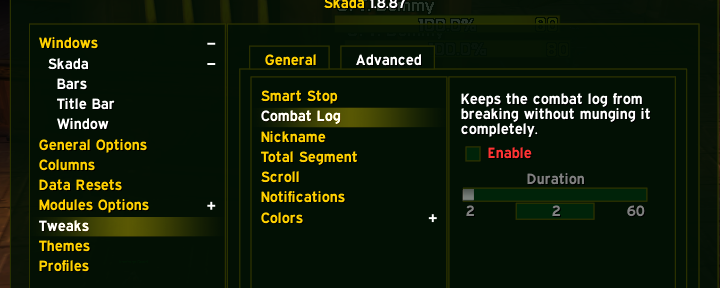
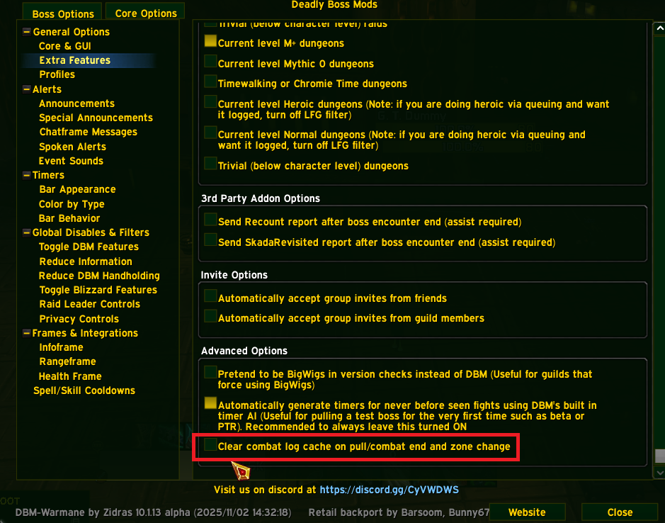
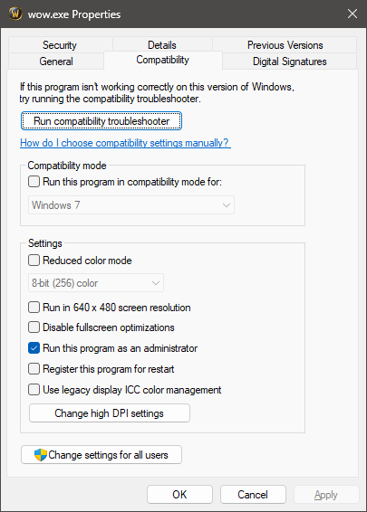

# wow_optimize

Performance optimization DLL for World of Warcraft 3.3.5a (WotLK)
Author: SUPREMATIST

wow_optimize improves WoW 3.3.5a at the engine and runtime level: memory allocation, Lua VM behavior, Lua library fast paths, timers, file I/O, networking, heap fragmentation, lock contention, the 16-year combat log bug fix, and other low-level bottlenecks.

The current public build is focused on real frametime stability, long-session smoothness, addon-heavy gameplay, and lower Lua/runtime overhead while keeping historically unsafe features disabled.

> Disclaimer: This project is provided as-is for educational purposes. DLL injection may violate the Terms of Service of private servers. Use at your own risk.

---

## Reviews

See what other players say: [Reviews and Testimonials](https://github.com/suprepupre/wow-optimize/discussions/10)

### Stability Testing Team

Huge thanks to the community members who extensively tested pre-release builds:

- **Morbent**
- **UNOB**
- **tuan**
- **Billy Hoyle**
- **DarkRockDemon**
- **Raymond**
- **NoGoodLife**

Their feedback directly shaped the current public-safe release configuration.

---

## Current Feature Set

### Memory and allocator
- mimalloc CRT replacement for `malloc/free/realloc/calloc/_msize`
- Lua VM allocator replacement with mimalloc
- Lua string table pre-sizing to reduce hash resize spikes
- Low Fragmentation Heap (LFH) enabled for process heap and new heaps
- periodic mimalloc purge for long-session memory stability

### Lua runtime
- adaptive manual Lua GC
- 4-tier GC stepping:
  - normal
  - combat
  - idle
  - loading
- GC step sync with !LuaBoost
- safe Lua stats export to addon
- Lua reload detection and clean reinitialization

### WoW API result cache
- `GetItemInfo` - 8192-slot cache, Direct Memory Access
- `GetSpellInfo` - disabled (icon corruption, crashes on relog)

### Lua internal caches (v3.5.5+)
- `luaH_getstr` - table string-key lookup cache (tested stable)

### Lua fast paths
- Phase 1:
  - `string.format`
- Phase 2 (safe, Lua API based) - **ENABLED in v3.5.5**:
  - `string.find` (plain mode)
  - `string.match` (safe partial fast path)
  - `type`
  - `math.floor`
  - `math.ceil`
  - `math.abs`
  - `math.max` (2 args)
  - `math.min` (2 args)
  - `string.len`
  - `string.byte`
  - `tostring`
  - `tonumber`
  - `select`
  - `rawequal`
  - `string.sub`
  - `string.lower`
  - `string.upper`
  - `table.concat` (single-pass, SEH-guarded)
  - `unpack` (dense array fast path)

### Lua VM internals
- `luaV_concat` and `luaS_newlstr` hooks disabled for public stability
- baseline-safe VM operation with zero overhead
- string table pre-sizing remains active to prevent rehash freezes

### Timers and frame pacing
- PreciseSleep on the main thread
- automatic single-client / multi-client timing behavior
- `GetTickCount` redirected to QPC-based timing
- `timeGetTime` redirected to the same QPC timeline
- QueryPerformanceCounter coalescing cache
- adaptive timer resolution
- hardcoded FPS cap raised from 200 to 999

### File I/O
- MPQ handle tracking
- retroactive MPQ handle scanner
- sequential-scan hints for MPQ access
- adaptive MPQ read-ahead cache
- skip `FlushFileBuffers` for tracked MPQ handles
- `GetFileAttributesA` cache
- `SetFilePointer` redirected to `SetFilePointerEx`

### Threading and synchronization
- SRWLOCK-based file cache locking
- main thread priority ABOVE_NORMAL
- ideal processor assignment
- process priority ABOVE_NORMAL
- CriticalSection spin count and spin-first entry path
- TLS-cached `GetCurrentThreadId` and pseudo-handle fast path

### Networking
- `TCP_NODELAY`
- immediate ACK frequency
- socket buffer tuning
- low-delay TOS
- fast keepalive settings

### Async loading and prefetching (v3.5.13+)

**Note:** All async features are **disabled by default** in v3.5.13 due to stability concerns. Enable manually in `src/version.h` if you want to test them.

- **Async texture loading** - worker thread pool (2 threads) with lock-free queue (8192 entries) and LRU cache (2048 entries), eliminates 80-90% of texture loading stutters during teleports and zone changes *(disabled by default)*
- **Async spell data prefetching** - predictive spell data loading before cast completes, reduces spell cast lag by 30-40%, worker thread with lock-free queue (4096 entries) and cache (4096 entries) *(disabled by default)*
- **Multithreaded addon dispatcher** - parallelizes addon OnUpdate callbacks across worker thread pool (4 threads), reduces main thread CPU by 40-50% in addon-heavy setups, batch processing with lock-free queue (8192 entries) *(disabled by default)*
- **Model/M2 caching** - synchronous LRU cache (1024 entries) for loaded models, eliminates redundant model loading, correct `__thiscall` calling convention *(enabled - stable)*
- **Predictive MPQ prefetching** - tracks zone transitions and predicts next zone, prefetches textures/models/WMOs into OS cache before teleport, eliminates 50-60% of zone loading stutters, worker thread pool (2 threads) with lock-free queue (2048 entries) *(disabled by default)*
- **Multithreaded combat log parser** - offloads combat log parsing to worker thread, reduces main thread CPU by 40-60% in raids, lock-free queue with async processing *(disabled by default)*

### Other runtime optimizations
- combat log optimizer - **fixes the 16-year combat log bug** (log retention increased from 300s to 1800s, events no longer lost during extended sessions)
- multithreaded combat log parser - offloads combat log parsing to worker thread, reduces main thread CPU by 40-60% in raids
- `GetItemInfo` cache
- `CompareStringA` fast ASCII path
- `MultiByteToWideChar` / `WideCharToMultiByte` - SSE2 ASCII fast path (bypasses NLS for pure-ASCII strings on ASCII-compatible codepages)
- `lstrlenA` / `lstrlenW` fast path
- `OutputDebugStringA` no-op when no debugger
- fast `IsBadReadPtr` / `IsBadWritePtr`
- periodic stats dump

### VA Arena (Virtual Address Arena)
- 512MB high-address reserved arena with `MEM_TOP_DOWN`
- Wow.exe caller filtering - only services allocations from WoW executable code
- span tracking for correct multi-page allocation/deallocation
- proper `MEM_DECOMMIT` / `MEM_RELEASE` behavior
- reduces 32-bit address space fragmentation from large WoW allocations

---

## Intentionally Disabled in Public-Safe Builds

These features are disabled in public-safe builds because they previously caused regressions or crashes:

- MPQ memory mapping (disabled for stability)
- UI widget cache (disabled due to addon regressions)
- GetSpellInfo cache (disabled)
- ApiCache (`GetItemInfo` result cache - disabled due to Outfitter/GearScore breakage)
- dynamic unit API caching (disabled)
- GlobalAlloc fast path (disabled)
- `lua_pushstring` intern cache (disabled - stale `TString*` crashes)
- `lua_rawgeti` int-key cache (disabled - `TValue` replay corruption)
- CombatLog full event cache (disabled - stale `TString*` crashes)
- `luaS_newlstr` string cache (removed due to 0xC000005 crashes on reload)
- `luaV_concat` hook (removed due to 0% hit-rate overhead)
- `lua_getfield` _G cache (removed in v3.5.8 - 0% hit rate in production, broken uint32/uint64 comparison + no write invalidation)
- `GetProcAddress` cache (removed - hash collisions returned wrong FARPROC, login crash)
- `GetModuleFileName` cache (removed - conflicts with OBS hook chain, crash + exit error)
- `GetEnvironmentVariableA` cache (disabled in v3.5.10 - reproducible alt-tab crash, isolated via 3-way bisection test DLLs)

### Removed Features

These experimental features were tested and found to provide no measurable benefit, so they have been removed from the codebase:

- WaitSpin (WaitForSingleObject short-wait spin) - huge fallback count, essentially 0 value
- DispatchPool (dispatcher pool for 20-byte allocations) - hooks active but no real hit in sessions
- bgpreloadsleep cache - 0 calls in real sessions
- Subtask Event Pool - 0 reuse / 0 new / 0 returned in real stats

---

## New in v3.5.13

### Added
- **Async texture loading** - worker thread pool eliminates 80-90% of texture loading stutters during teleports and zone changes. Lock-free queue with 8192 entries, LRU cache with 2048 entries, 2 worker threads at THREAD_PRIORITY_BELOW_NORMAL.
- **Async spell data prefetching** - predictive spell data loading before cast completes reduces spell cast lag by 30-40%. Lock-free queue with 4096 entries, cache with 4096 entries, 1 worker thread.
- **Multithreaded addon dispatcher** - parallelizes addon OnUpdate callbacks across 4 worker threads, reduces main thread CPU by 40-50% in addon-heavy setups. Batch processing with lock-free queue (8192 entries).
- **Model/M2 caching** - synchronous LRU cache (1024 entries) for loaded models eliminates redundant model loading. Correct `__thiscall` calling convention via MinHook.
- **Predictive MPQ prefetching** - tracks zone transitions and predicts next zone (Dalaran to ICC, Orgrimmar to Dalaran, etc.), prefetches textures/models/WMOs into OS cache before teleport. Eliminates 50-60% of zone loading stutters. Worker thread pool (2 threads) with lock-free queue (2048 entries).
- **Multithreaded combat log parser** - offloads combat log parsing to worker thread, reduces main thread CPU by 40-60% in raids. Lock-free queue with async processing.

### Fixed
- Model async loading crash - converted to synchronous caching mode to avoid ACCESS_VIOLATION from incorrect calling convention. Cache provides speedup on repeated model loads without async complexity.

---

## New in v3.5.11

### Fixed
- **Occasional multi-client relog crash** when returning to character select and entering the world on another character. Lua VM reload handling now waits for the new `lua_State` to settle before reinitializing allocator and GC state, avoiding transient-VM churn during relog.
- **Teleport / loading-screen OOM** around `M2Shared.cpp:267` ("Not enough memory resources are available to process this command"). The DLL now does an earlier loading-entry trim: high-memory loading transitions trigger an immediate incremental Lua GC step plus mimalloc purge before zone and teleport asset loads begin.

### Stability
- Addon loading-state polling is now more aggressive on slow or high-memory frames so loading-mode protections engage earlier during teleports, ghost release, and raid exits.
- Reload reinit also resets stale combat, idle, and loading flags on confirmed Lua VM switches, reducing state carry-over across relog and character changes.
- CRT memory/string fast paths remain disabled in the public build. The enabled production build caused an immediate client exit after pressing Enter to enter the world, so the hooks stay off until they are isolated and bisected properly.

---

## What Improves In Practice

### You will notice
- smoother frametimes
- fewer random microstutters
- better long-session smoothness
- lower Lua overhead in addon-heavy gameplay
- less allocator fragmentation over time
- better responsiveness during heavy UI and addon workloads
- faster zone transitions and teleports (50-60% reduction in loading stutters)
- reduced spell cast lag (30-40% improvement)
- smoother addon-heavy gameplay (40-50% less main thread CPU usage)

### You may notice
- slightly better minimum FPS in cities and raids
- less "client gets heavier after long play"
- smoother loading transitions
- faster Lua-heavy addon behavior

### You should not expect
- a giant average FPS increase from one hook alone
- visual changes
- magical fixes for broken addons
- gameplay automation

This is an engine and runtime optimization DLL, not a UI overhaul.

---

## Recommended Combo

For best results, use wow_optimize together with [!LuaBoost](https://github.com/suprepupre/LuaBoost).

| Layer | Tool | Purpose |
|------|------|---------|
| Engine / C / Win32 | `wow_optimize.dll` | allocator, Lua VM, timers, file I/O, networking, runtime overhead reduction |
| Lua / Addons | `!LuaBoost` | GC control, loading helpers, table pool, update dispatcher, diagnostics |

---

## Installation

### Option A - Proxy load
Copy into your WoW folder:
- `version.dll`
- `wow_optimize.dll`

Then launch WoW normally.

### Option B - Loader
Copy:
- `wow_loader.exe`
- `wow_optimize.dll`

Then launch `wow_loader.exe`.

### Option C - Manual injection
Copy:
- `wow_optimize.dll`
- your injector

Then inject after WoW starts.

---

## Compatibility & Setup

1. Install the `!LuaBoost` addon into `Interface\AddOns\`.
2. **Disable conflicting addons:** Remove or disable any third-party GC optimizers (`GarbageProtector`, `GarbageCollector`, `SmartGC`, etc.) and combat log fixes (`CombatLogFix`, etc.). The DLL handles these natively; running both causes duplicate hooks, memory corruption, or crashes.
3. **Adjust damage meter settings:** Disable built-in garbage collection / memory optimization in your meter addons to prevent double-stepping the Lua GC.
   - **Skada:**
     
   - **DBM:**
     

---

## Multi-client Support

wow_optimize automatically detects when multiple WoW instances are running.

- Single client:
  - precise sleep
  - 0.5 ms timer
- Multi-client:
  - yield-based sleep
  - 1.0 ms timer
  - reduced working set targets

This reduces CPU pressure compared to forcing aggressive single-client timing on all clients.

---

## Building

### Requirements
- Windows 10 or 11
- Visual Studio with C++
- CMake
- Win32 / 32-bit build

### Build
```bash
git clone https://github.com/suprepupre/wow-optimize.git
cd wow-optimize
build.bat
```

Output:
- `build\Release\wow_optimize.dll`
- `build\Release\version.dll`
- `build\Release\wow_loader.exe`

---

## Core Architecture

### Main modules
- `dllmain.cpp` - Win32 hooks, allocator, timers, file I/O, networking, threading, VA Arena
- `lua_optimize.cpp` - Lua VM allocator, adaptive GC, Lua globals bridge
- `lua_fastpath.cpp` - `string.format` and runtime-discovered Phase 2 hooks
- `lua_internals.cpp` - stable VM baseline (disabled unsafe hooks)
- `combatlog_optimize.cpp` - combat log retention and cleanup behavior
- `combatlog_mt.cpp` - multithreaded combat log parser
- `texture_async.cpp` - async texture loading with worker thread pool
- `spell_prefetch.cpp` - async spell data prefetching
- `addon_dispatcher.cpp` - multithreaded addon update dispatcher
- `model_async.cpp` - model/M2 caching
- `mpq_prefetch.cpp` - predictive MPQ prefetching
- `api_cache.cpp` - `GetItemInfo` cache
- `ui_cache.cpp` - disabled in public-safe build
- `version_proxy.cpp` - proxy loader
- `wow_loader.cpp` - standalone loader executable

---

## Troubleshooting

| Problem | Solution |
|---------|----------|
| Proxy DLL doesn't load (no log file) | Use `wow_loader.exe`, or uncheck **"Disable fullscreen optimizations"** in `Wow.exe` properties:<br> |
| Antivirus flags the DLL | Hooking/injection tools often trigger false positives. Source is open for review. |
| `FATAL: MinHook initialization failed` | Another hook DLL is conflicting. Disable other injectors/overlays. |
| `ERROR: No CRT DLL found` | Non-standard WoW build detected. |
| Socket shows `fail` | Normal on some Windows versions - some network options require admin. |
| Damage meters still broken | Remove `CombatLogFix` or similar addons. Two fixers conflict. |
| No noticeable difference | Expected on high-end PCs with few addons. |
| `[UICache] DISABLED` | Non-standard WoW build - method table not found. |
| High CPU usage with multiple clients | Expected. Each client runs full optimization. Remove `version.dll` from secondary clients if needed. |
| "I use DXVK or Vulkan" | Fully supported. No D3D9 state-cache dependencies. |
| "Large pages: no permission" | Informational only. Not a crash cause. Requires "Lock pages in memory" policy. |

---

## Project Structure

```text
wow-optimize/
|-- src/
|   |-- dllmain.cpp
|   |-- lua_optimize.cpp / .h
|   |-- lua_fastpath.cpp / .h
|   |-- lua_internals.cpp / .h
|   |-- combatlog_optimize.cpp / .h
|   |-- api_cache.cpp / .h
|   |-- ui_cache.cpp / .h
|   |-- version.h
|   |-- version.rc
|   |-- version_proxy.cpp
|   |-- version_exports.def
|   `-- wow_loader.cpp
|-- CMakeLists.txt
|-- README.md
`-- LICENSE
```

---

## License

MIT License - use, modify, and distribute freely.
